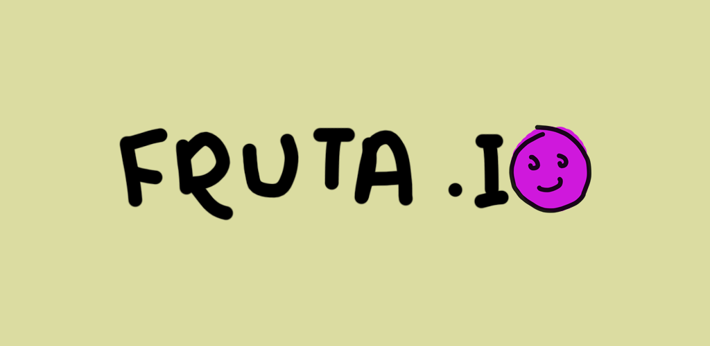

**fruta.io** is a physics-based matching puzzle game for Android devices. Drop fruit in a bucket to combine them! Can you get the highest score?

# Play on Android

fruta.io is [available for Android devices on the Play Store](https://play.google.com/store/apps/details?id=com.LinsDev.frutaio)!

# Web preview

A web-based preview version is available on [itch.io](https://fizzydrinks.itch.io/frutaio).

# Development

If you want to work on the project, you'll need Godot v4.1. Import the project as normal and it should be playable on the editor.

Textures are made using Adobe Photoshop. PSD files are available in the same directories as the corresponding PNGs.
